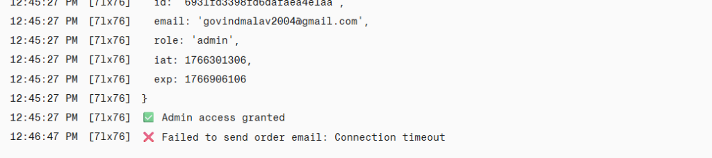
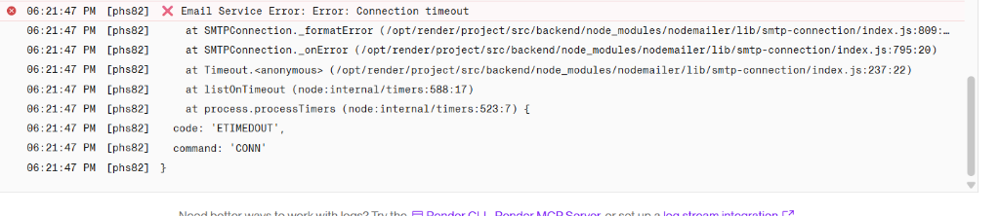

# ⚡ Mahalakshmi Power & Plumbs - Vendor Portal


> A premium, full-stack vendor management platform built for speed, security, and aesthetics. Features automated email notifications, PDF invoice generation, and a seamless ordering experience.

---

## 📸 Screenshots

*(Add your application screenshots here)*

| Landing Page | Vendor Dashboard |
|:---:|:---:|
|  |  |

---

## 🚀 Key Features

*   **🛒 Seamless Ordering**: Intuitive product catalog with dynamic "Essentials" sections.
*   **📧 Automated Notifications**: Instant, beautiful HTML email confirmations via **Resend** (No SMTP timeouts!).
*   **📄 PDF Invoicing**: Automatic invoice generation for every order using PDFKit.
*   **🔐 Secure Authentication**: Robust JWT-based authentication for vendors and admins.
*   **🎨 Premium UI/UX**: Built with **TailwindCSS** and **Framer Motion** for glassmorphism effects and smooth animations.
*   **📱 Fully Responsive**: Optimized for all devices, from mobile phones to unauthorized desktops.

---

## 🛠️ Technology Stack

### Frontend
*   **Framework**: [React.js](https://reactjs.org/) (Vite)
*   **Styling**: [TailwindCSS](https://tailwindcss.com/)
*   **Animations**: [Framer Motion](https://www.framer.com/motion/)
*   **Routing**: React Router DOM
*   **HTTP Client**: Axios

### Backend
*   **Runtime**: [Node.js](https://nodejs.org/) & [Express.js](https://expressjs.com/)
*   **Database**: [MongoDB](https://www.mongodb.com/) (Mongoose)
*   **Email Service**: [Resend SDK](https://resend.com/) (Transactional API)
*   **Authentication**: JSON Web Tokens (JWT)
*   **Utilities**: PDFKit (Invoices), Dotenv

---

## 💾 Installation & Setup

Follow these steps to set up the project locally.

### Prerequisites
*   Node.js (v16+)
*   MongoDB URI
*   Resend API Key

### 1. Clone the Repository
```bash
git clone https://github.com/Govind-Malav/Mahalakshmi-Power-and-Plumbs.git
cd Mahalakshmi-Power-and-Plumbs
```

### 2. Backend Setup
```bash
cd backend
npm install
```
Create a `.env` file in the `backend` folder:
```env
PORT=5000
MONGO_URI=your_mongodb_connection_string
JWT_SECRET=your_jwt_secret
ADMIN_EMAIL=your_admin_email@example.com
RESEND_API_KEY=re_your_resend_api_key
```
Start the server:
```bash
npm run dev
```

### 3. Frontend Setup
Open a new terminal:
```bash
cd frontend
npm install
npm run dev
```

---

## 🔗 APIs & Integrations

The system integrates with **Resend** for reliable email delivery.
*   **Resend**: Replaced standard SMTP to bypass port blocking on cloud platforms like Render/AWS.
*   **Templates**: Custom HTML/CSS email templates are located in `backend/utils/sendOrderEmail.js`.

---

## 🤝 Contributing

1.  Fork the repository.
2.  Create a new branch (`git checkout -b feature/AmazingFeature`).
3.  Commit your changes (`git commit -m 'Add some AmazingFeature'`).
4.  Push to the branch (`git push origin feature/AmazingFeature`).
5.  Open a Pull Request.

---

## 📞 Contact

**Govind Malav** - [GitHub Profile](https://github.com/Govind-Malav)

Project Link: [https://github.com/Govind-Malav/Mahalakshmi-Power-and-Plumbs](https://github.com/Govind-Malav/Mahalakshmi-Power-and-Plumbs)
